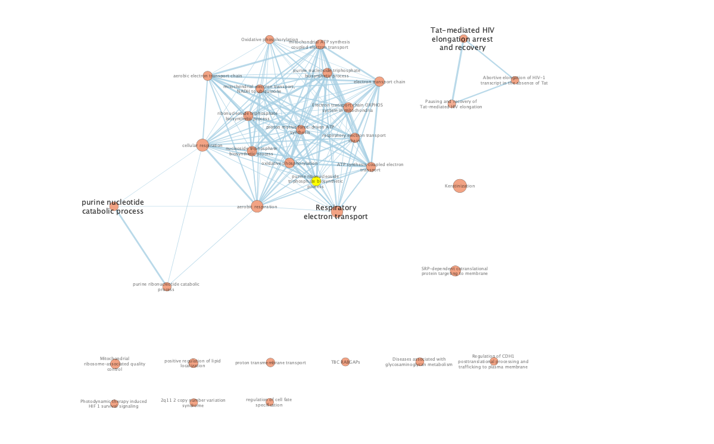
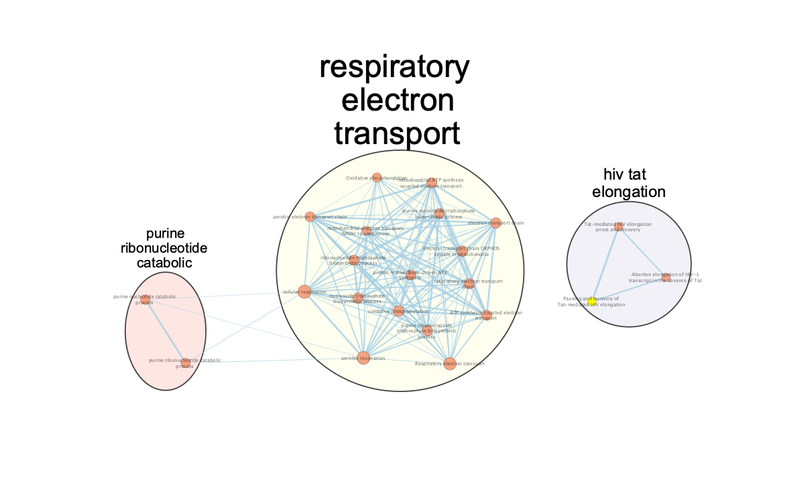
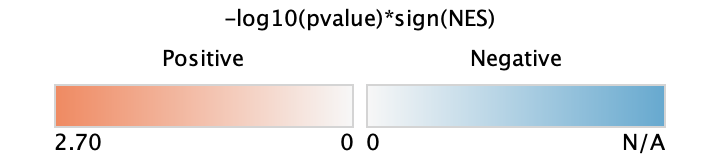

```{r setup, include=FALSE}
knitr::opts_chunk$set(
  echo = TRUE,
  warning = FALSE,
  message = FALSE,
  fig.width = 10,
  fig.height = 6
)

PALETTE_BASELINE  <- "#E69F00"
PALETTE_POST      <- "#009E73"
condition_colors  <- c("Baseline" = PALETTE_BASELINE,
                        "Post_Treatment" = PALETTE_POST)
```

---

# Introduction

## The Biology of Tumour Fibrosis and Mechanical Conditioning

Breast cancer outcomes are shaped not only by the tumour cells themselves but by the microenvironment in which they grow. In a subset of HER2-negative breast cancers, excessive fibrosis — driven by cancer-associated fibroblasts (CAFs) — leads to pathological stiffening of the extracellular matrix (ECM). This physical change has molecular consequences: tumour cells sense ECM stiffness through integrin receptors on their surface, which activate downstream mechanotransduction cascades through focal adhesion kinase (FAK), the Hippo pathway effector YAP/TAZ, and RHO GTPases. The result is a cell-autonomous transcriptional programme that promotes survival, invasion, and resistance to cytotoxic therapy — not because of a genetic mutation, but because of the mechanical state of the cell's environment.

Quintela-Fandino et al. [@quintela2024] operationalized this phenomenon as the **Mechanical Conditioning (MeCo) score**: a 1,004-gene RNA expression signature derived from genes whose expression is systematically altered by ECM stiffness in breast epithelial cells. In clinical tumour biopsies, a high MeCo score indicates that tumour cells are actively undergoing mechanosensing-driven transcriptional reprogramming. The authors demonstrated that high MeCo at baseline is a strong predictor of poor outcomes in HER2-negative breast cancer treated with standard chemotherapy (HR = 0.21, p = 0.0075 in the control arm), independent of other clinical features.

## Nintedanib as an Anti-Fibrotic Strategy

**Nintedanib** is a multi-target tyrosine kinase inhibitor approved for idiopathic pulmonary fibrosis that acts by inhibiting PDGFR, FGFR, and VEGFR — the three receptor families that drive CAF activation, collagen deposition, and ECM stiffening. The hypothesis of the Quintela-Fandino trial was that repurposing nintedanib in breast cancer would pharmacologically reverse tumour fibrosis, reduce ECM stiffness, lower the MeCo score, and thereby restore chemotherapy sensitivity in high-MeCo patients. Critically, the study design included a nintedanib **run-in phase** — two weeks of nintedanib monotherapy before paclitaxel was added — specifically to measure the drug's pharmacodynamic effect on the MeCo score before any cytotoxic confounding. Nintedanib reduced the MeCo score by **25%** during this run-in phase (p < 0.01), confirming pharmacodynamic target engagement.

Patients who achieved low MeCo scores after the run-in had dramatically better long-term prognosis (HR = 0.087, p = 0.03), making the run-in MeCo score one of the most powerful prognostic biomarkers reported in this disease setting. After a median follow-up of 9.67 years, overall event-free survival was not statistically different between treatment arms (p = 0.37), but the MeCo-stratified analysis demonstrated that nintedanib specifically corrects the poor prognosis of high-MeCo patients.

## The RNA-seq Data and the Question This Assignment Asks

The RNA sequencing data deposited at GEO accession **GSE255359** [@quintela2024] was generated from tumour biopsies collected at two time points in the trial:

| Time point | Samples | Description |
|---|---|---|
| Baseline | 76 | Pre-treatment biopsy, before nintedanib run-in |
| Post-run-in | 32 | Biopsy after nintedanib run-in, before paclitaxel |
| **Total** | **108** | Analysed in Assignment 1 and this report |

The post-run-in samples were collected from patients in the experimental arm after nintedanib monotherapy. Therefore, the differential expression comparison (post-run-in vs. baseline) captures the **transcriptional effect of nintedanib's anti-fibrotic activity specifically**, prior to any paclitaxel exposure. This is the most direct transcriptomic window into nintedanib's mechanism available in this dataset.

The central question this assignment asks is: **what biological pathways and processes are transcriptionally remodelled by nintedanib's anti-fibrotic activity?** More specifically, if nintedanib is reducing the MeCo score — reversing mechanosensing-driven transcriptional reprogramming — which pathways should we expect to see change, and do the pathway enrichment results match those expectations? The MeCo score itself reflects the activity of integrin–FAK–YAP mechanosensing cascades, downstream metabolic programmes, and ECM-remodelling genes. If nintedanib is pharmacologically withdrawing this programme, we would predict: downregulation of integrin adhesion and mechanosensing terms, changes in metabolic gene expression as cells exit the hypoxic fibrotic stroma, and potentially upregulation of immune programmes as the ECM barrier to immune infiltration is reduced.

## Summary of Assignment 1: Data Processing and Differential Expression

The raw count matrix from GSE255359 comprised **60,660 genes** across 108 samples. Processing proceeded as follows.

**Gene filtering.** Ensembl gene identifiers were mapped to HUGO gene symbols using biomaRt [@biomart]. Genes without a unique HUGO mapping were removed. Lowly expressed genes were filtered using the `filterByExpr` function from edgeR [@edger], which retains genes expressed at sufficient levels in a minimum number of samples. After filtering, **16,280 genes** were retained.

**Normalization.** Library sizes were normalized using **TMM (Trimmed Mean of M-values)** via edgeR [@edger]. TMM was selected because it corrects for compositional bias — a critical property for clinical tumour samples where a small number of highly expressed inflammatory or oncogenic genes can otherwise inflate apparent library size differences between samples. Normalization factors ranged from **0.93 to 1.07**, indicating minimal systematic bias between samples.

**Differential expression.** Post-run-in vs. Baseline expression differences were tested using edgeR's **quasi-likelihood (QL) F-test**, which uses a negative binomial model with empirical Bayes dispersion shrinkage. The biological coefficient of variation (BCV = 0.41) reflects expected inter-patient heterogeneity in clinical breast cancer biopsies. At FDR < 0.05 and |log₂FC| > 1, **2,867 genes were significantly differentially expressed**:

| Direction | Count |
|---|---|
| Upregulated (post-run-in vs. baseline) | 1,543 |
| Downregulated (post-run-in vs. baseline) | 1,324 |
| **Total DEGs** | **2,867** |

These gene lists and the full ranked gene list form the inputs to the pathway enrichment analyses in this report.

## Analytical Approach

This report applies two complementary pathway enrichment strategies, chosen specifically to address the limitations of each method when used alone:

**Thresholded Over-Representation Analysis (ORA)** using g:Profiler [@gprofiler2] asks which GO:BP, Reactome, and WikiPathways terms are statistically over-represented among genes that cross a significance threshold (FDR < 0.05, |log₂FC| > 1). ORA is most sensitive to programmes driven by a discrete set of strongly and consistently differentially expressed genes — the kind of sharp, on-target transcriptional response expected from nintedanib's direct inhibition of pro-fibrotic receptor kinases. Because ORA is run separately on upregulated and downregulated gene lists, it can distinguish which pathways are activated from which are suppressed.

**Non-thresholded Gene Set Enrichment Analysis (GSEA)** [@subramanian2005] uses the full ranked list of all 16,280 expressed genes and asks whether the members of a gene set tend to cluster at the top or bottom of the ranking — without requiring any gene to individually cross a threshold. GSEA is better suited to detecting coordinated but individually modest expression shifts, such as the gradual de-repression of a mechanosensing programme across hundreds of genes. The Bader Lab Human GO Biological Process gene set collection (September 2025) was used to maximize comparability with the ORA results.

Results are visualized using Cytoscape [@cytoscape] with EnrichmentMap [@enrichmentmap] and AutoAnnotate [@autoannotate], which group gene sets into biological themes and reveal higher-order structure in the enrichment landscape that is not apparent from ranked pathway lists alone.

---


# Package Installation and Loading

```{r install_packages}
# CRAN packages
cran_pkgs <- c("dplyr", "ggplot2", "readr", "tibble", "tidyr",
               "ggrepel", "knitr", "RColorBrewer", "patchwork",
               "stringr", "gprofiler2")

for (pkg in cran_pkgs) {
  if (!requireNamespace(pkg, quietly = TRUE))
    install.packages(pkg, repos = "https://cloud.r-project.org")
}

# Bioconductor packages
if (!requireNamespace("BiocManager", quietly = TRUE))
  install.packages("BiocManager", repos = "https://cloud.r-project.org")

bioc_pkgs <- c("GEOquery", "edgeR", "biomaRt")

for (pkg in bioc_pkgs) {
  if (!requireNamespace(pkg, quietly = TRUE)) BiocManager::install(pkg, ask = FALSE)
}
```

```{r load_libraries}
library(GEOquery)    # Davis & Meltzer 2007
library(readr)       # Wickham et al. 2025
library(dplyr)       # Wickham et al. 2023
library(tibble)      # Müller & Wickham 2025
library(tidyr)       # Wickham et al. 2024
library(ggplot2)     # Wickham 2016
library(ggrepel)     # Slowikowski 2024
library(knitr)       # Xie 2014
library(edgeR)       # Chen et al. 2025
library(biomaRt)     # Durinck et al. 2009
library(RColorBrewer) # Neuwirth 2022
library(patchwork)   # Pedersen 2025
library(stringr)     # Wickham 2023
library(gprofiler2)  # Raudvere et al. 2019
```

The following packages are used in this analysis: GEOquery [@GEOquery], edgeR [@edger], biomaRt [@biomart], gprofiler2 [@gprofiler2], ggplot2 [@ggplot2], ggrepel [@ggrepel], dplyr [@dplyr], readr [@readr], tibble [@tibble], tidyr [@tidyr], knitr [@knitr], patchwork [@patchwork], RColorBrewer [@RColorBrewer], and stringr [@stringr]. Bioconductor package installation is managed via BiocManager [@BiocManager]. Report rendering uses R Markdown [@rmarkdown].

---

# Data Reconstruction from Assignment 1

To ensure full reproducibility, the data processing pipeline from Assignment 1 is re-run here. The gene identifier mapping step uses a local cache (`gene_mapping_cache.rds`) to avoid repeated calls to the Ensembl biomaRt server, which can time out under poor network conditions. If the cache does not exist, the mapping is performed and saved for future runs.

```{r reconstruct_data, message=FALSE, warning=FALSE, results='hide'}
# ── 1. Load raw counts ────────────────────────────────────────────────────────
# Mirrors A1 exactly: raw_counts is a tibble; counts drops the geneID column
if (!file.exists("GSE255359/GSE255359_RAW_RNAseq_counts.csv.gz")) {
  getGEOSuppFiles("GSE255359", makeDirectory = TRUE)
}

raw_counts <- read_csv("GSE255359/GSE255359_RAW_RNAseq_counts.csv.gz",
                       show_col_types = FALSE)

# counts is a tibble — gene IDs are kept in raw_counts$geneID, not as rownames
counts <- raw_counts[, -1]
rownames(counts) <- raw_counts$geneID   # sets rownames on the tibble for compat

# ── 2. Sample metadata ────────────────────────────────────────────────────────
sample_names <- colnames(counts)
samples <- data.frame(
  sample    = sample_names,
  condition = ifelse(grepl("POST", sample_names), "Post_Treatment", "Baseline"),
  row.names = sample_names,
  stringsAsFactors = FALSE
)
samples$condition <- factor(samples$condition)

# ── 3. Gene identifier mapping (cached to avoid Ensembl timeout) ──────────────
# gene_ids sourced from raw_counts$geneID, exactly as A1 does
gene_ids       <- raw_counts$geneID
gene_ids_clean <- gsub("\\..*", "", gene_ids)

cache_file <- "gene_mapping_cache.rds"

if (file.exists(cache_file)) {
  message("Loading gene mapping from cache: ", cache_file)
  gene_mapping <- readRDS(cache_file)
} else {
  message("Cache not found. Querying biomaRt (this may take several minutes)...")

  ensembl <- tryCatch({
    useMart("ensembl", dataset = "hsapiens_gene_ensembl",
            host = "https://www.ensembl.org")
  }, error = function(e) {
    message("Primary mirror timed out, trying useast.ensembl.org...")
    tryCatch({
      useMart("ensembl", dataset = "hsapiens_gene_ensembl",
              host = "https://useast.ensembl.org")
    }, error = function(e2) {
      message("useast failed, trying asia.ensembl.org...")
      useMart("ensembl", dataset = "hsapiens_gene_ensembl",
              host = "https://asia.ensembl.org")
    })
  })

  gene_mapping <- getBM(
    attributes = c("ensembl_gene_id", "hgnc_symbol"),
    filters    = "ensembl_gene_id",
    values     = gene_ids_clean,
    mart       = ensembl
  )

  saveRDS(gene_mapping, file = cache_file)
  message("Saved gene mapping cache to: ", cache_file)
}

# Restore versioned Ensembl IDs for matching — mirrors A1
gene_mapping$ensembl_gene_id_version <-
  gene_ids[match(gene_mapping$ensembl_gene_id, gene_ids_clean)]

gene_mapping_valid <- gene_mapping %>%
  filter(hgnc_symbol != "" & !is.na(hgnc_symbol))

# ── 4. Aggregate duplicate HUGO symbols ──────────────────────────────────────
# Mirrors A1: counts_with_symbols built from counts (tibble), adds ensembl cols
counts_with_symbols <- counts
counts_with_symbols$ensembl_id       <- raw_counts$geneID
counts_with_symbols$ensembl_id_clean <- gsub("\\..*", "", raw_counts$geneID)

counts_mapped <- counts_with_symbols %>%
  left_join(
    gene_mapping_valid %>%
      dplyr::select(ensembl_gene_id, hgnc_symbol) %>% distinct(),
    by = c("ensembl_id_clean" = "ensembl_gene_id")
  ) %>%
  filter(!is.na(hgnc_symbol))

counts_final <- counts_mapped %>%
  dplyr::select(-ensembl_id, -ensembl_id_clean) %>%
  group_by(hgnc_symbol) %>%
  summarise(across(everything(), sum), .groups = "drop") %>%
  as.data.frame()

rownames(counts_final) <- counts_final$hgnc_symbol
counts_final <- counts_final %>% dplyr::select(-hgnc_symbol)

# ── 5. TMM normalization ──────────────────────────────────────────────────────
dge          <- DGEList(counts = as.matrix(counts_final),
                        group  = samples$condition)
keep         <- filterByExpr(dge, group = samples$condition)
dge_filtered <- dge[keep, , keep.lib.sizes = FALSE]
dge_filtered <- calcNormFactors(dge_filtered, method = "TMM")

# ── 6. Differential expression (QL framework) ────────────────────────────────
design    <- model.matrix(~ 0 + condition, data = samples)
colnames(design) <- levels(samples$condition)

edge      <- estimateDisp(dge_filtered, design)
fit       <- glmQLFit(edge, design)
contrasts <- makeContrasts(Post_vs_Baseline = Post_Treatment - Baseline,
                           levels = design)
qlf       <- glmQLFTest(fit, contrast = contrasts[, "Post_vs_Baseline"])

de_results <- topTags(qlf, n = Inf)$table %>%
  rownames_to_column("gene")

# ── 7. Thresholds ─────────────────────────────────────────────────────────────
fdr_threshold <- 0.05
fc_threshold  <- 1   # log2 scale — corresponds to 2-fold change

sig_genes  <- de_results %>%
  filter(FDR < fdr_threshold, abs(logFC) > fc_threshold)
up_genes   <- sig_genes %>% filter(logFC >  fc_threshold) %>% pull(gene)
down_genes <- sig_genes %>% filter(logFC < -fc_threshold) %>% pull(gene)

cat("Total significant DE genes:", nrow(sig_genes), "\n")
cat("  Upregulated:  ", length(up_genes), "\n")
cat("  Downregulated:", length(down_genes), "\n")
```

## Data Visualization

```{r a1_mds_plot, fig.width=7, fig.height=5, fig.cap="**Figure 1: MDS plot of all 108 samples after TMM normalization.** Each point represents one sample; colour indicates condition (orange = Baseline, green = Post-treatment). Dimension 1 (x-axis) captures the largest source of variation in the dataset, separating the two conditions along the primary axis. The separation between conditions confirms that treatment produces a systematic and detectable transcriptional shift relative to baseline across the full patient cohort."}
mds <- plotMDS(dge_filtered, plot = FALSE)
mds_df <- data.frame(
  x         = mds$x,
  y         = mds$y,
  condition = samples[colnames(dge_filtered), "condition"]
)

ggplot(mds_df, aes(x = x, y = y, colour = condition)) +
  geom_point(size = 3, alpha = 0.8) +
  scale_colour_manual(values = condition_colors,
                      labels = c("Baseline", "Post-treatment")) +
  theme_classic(base_size = 12) +
  theme(legend.position = "right") +
  labs(
    title  = "MDS Plot — TMM-Normalized Expression",
    x      = paste0("Dimension 1 (", round(mds$var.explained[1]*100, 1), "% variance)"),
    y      = paste0("Dimension 2 (", round(mds$var.explained[2]*100, 1), "% variance)"),
    colour = "Condition"
  )
```

```{r a1_volcano_plot, fig.width=8, fig.height=6, fig.cap="**Figure 2: Volcano plot of differential expression results (Post-treatment vs. Baseline).** Each point represents one gene. Horizontal axis shows log2 fold change; vertical axis shows -log10(FDR). Red points meet both significance thresholds (FDR < 0.05 and |log2FC| > 1); grey points do not. Dashed vertical lines mark the ±1 log2FC threshold; dashed horizontal line marks FDR = 0.05. The 10 most significantly upregulated and downregulated genes are labelled."}
de_plot <- de_results %>%
  mutate(
    significance = case_when(
      FDR < fdr_threshold & logFC >  fc_threshold ~ "Upregulated",
      FDR < fdr_threshold & logFC < -fc_threshold ~ "Downregulated",
      TRUE ~ "Not significant"
    ),
    neg_log_fdr = -log10(FDR)
  )

# Top genes to label
top_label <- bind_rows(
  de_plot %>% filter(significance == "Upregulated")   %>% arrange(FDR) %>% head(10),
  de_plot %>% filter(significance == "Downregulated") %>% arrange(FDR) %>% head(10)
)

ggplot(de_plot, aes(x = logFC, y = neg_log_fdr, colour = significance)) +
  geom_point(size = 0.8, alpha = 0.5) +
  geom_point(data = top_label, size = 1.5, alpha = 1) +
  geom_text_repel(data = top_label, aes(label = gene),
                  size = 3, max.overlaps = 20,
                  box.padding = 0.4, show.legend = FALSE) +
  geom_vline(xintercept = c(-fc_threshold, fc_threshold),
             linetype = "dashed", colour = "grey40", linewidth = 0.4) +
  geom_hline(yintercept = -log10(fdr_threshold),
             linetype = "dashed", colour = "grey40", linewidth = 0.4) +
  scale_colour_manual(values = c("Upregulated"     = "#C0392B",
                                 "Downregulated"   = "#2980B9",
                                 "Not significant" = "grey70")) +
  theme_classic(base_size = 12) +
  theme(legend.position = "right") +
  labs(
    title    = "Volcano Plot — Post-treatment vs. Baseline",
    subtitle = paste0(nrow(sig_genes), " DEGs: ",
                      length(up_genes), " up, ",
                      length(down_genes), " down  |  FDR < 0.05, |log2FC| > 1"),
    x        = "log2 Fold Change (Post-treatment / Baseline)",
    y        = "-log10(FDR)",
    colour   = NULL
  )
```

The MDS plot (Figure 1) confirms that TMM normalization successfully captured the systematic transcriptional difference between baseline and post-treatment samples along the primary dimension of variation. The volcano plot (Figure 2) shows the distribution of differential expression across all `r nrow(de_results)` tested genes, with `r nrow(sig_genes)` genes (`r round(nrow(sig_genes)/nrow(de_results)*100, 1)`%) meeting both the fold-change and FDR thresholds.

---

# Gene List Export

The three gene lists required for g:Profiler thresholded ORA are saved here as plain text files (one gene per line). These files were used as direct input into the g:Profiler web application (https://biit.cs.ut.ee/gprofiler/gost), with the following settings: organism = Homo sapiens, sources = GO:BP + Reactome + WikiPathways, significance threshold = Benjamini-Hochberg FDR < 0.05, no evidence codes (IEA excluded), statistical domain scope = only annotated genes.

```{r export_gene_lists, message=FALSE}
dir.create("results", showWarnings = FALSE)
writeLines(sig_genes$gene, "results/all_degs.txt")
writeLines(up_genes,       "results/up_genes.txt")
writeLines(down_genes,     "results/down_genes.txt")
```

Three gene list files were written to `results/`: all DEGs (`r nrow(sig_genes)` genes), upregulated (`r length(up_genes)` genes), and downregulated (`r length(down_genes)` genes). These gene lists are derived from the edgeR quasi-likelihood differential expression results computed in the Data Reconstruction section above, filtered to FDR < 0.05 and |log₂FC| > 1. They were used as direct input to the g:Profiler web application.

---

# Ranked Gene List for GSEA


Non-thresholded gene set enrichment analysis (GSEA) requires a **ranked list** of all tested genes, not a binary significant/non-significant split. Genes are ranked by a signed statistic that captures both the magnitude and direction of differential expression.

The ranking metric used here is the **signed -log₁₀(p-value)**, defined as:

$$\text{rank score} = \text{sign}(\log_2\text{FC}) \times -\log_{10}(P\text{-value})$$

This metric is preferred over fold-change alone because it incorporates statistical confidence, rewarding genes that are both strongly and consistently changed across the 108 samples. It is a standard metric used in GSEA pre-ranking [@subramanian2005].

```{r ranked_gene_list, message=FALSE}
ranked_genes <- de_results %>%
  mutate(rank_score = sign(logFC) * -log10(PValue)) %>%
  arrange(desc(rank_score))

# Named numeric vector for compatibility with GSEA input
rank_vector <- setNames(ranked_genes$rank_score, ranked_genes$gene)

dir.create("results", showWarnings = FALSE)
write.table(
  data.frame(Gene = names(rank_vector), Score = rank_vector),
  file      = "results/ranked_gene_list.rnk",
  sep       = "\t",
  quote     = FALSE,
  row.names = FALSE,
  col.names = FALSE
)
```

The ranked list contains **`r length(rank_vector)` genes**, with scores ranging from `r round(min(rank_vector), 2)` to `r round(max(rank_vector), 2)`. The file was saved to `results/ranked_gene_list.rnk` for input into the GSEA desktop software.

```{r ranked_gene_list_preview}
head(ranked_genes %>%
       dplyr::select(gene, logFC, PValue, FDR, rank_score), 10) %>%
  mutate(across(where(is.numeric), ~ signif(.x, 4))) %>%
  kable(
    col.names = c("Gene", "log2FC", "P-value", "FDR", "Rank Score"),
    caption   = "Table 1: Top 10 ranked genes by signed -log10(p-value). Positive scores indicate upregulation post-treatment; negative scores indicate downregulation."
  )
```

```{r rank_distribution_plot, fig.width=9, fig.height=5}
ranked_genes %>%
  mutate(index = row_number(),
         direction = ifelse(rank_score > 0, "Upregulated", "Downregulated")) %>%
  ggplot(aes(x = index, y = rank_score, color = direction)) +
  geom_point(alpha = 0.3, size = 0.8) +
  scale_color_manual(values = c("Upregulated" = "#E63946",
                                "Downregulated" = "#457B9D")) +
  geom_hline(yintercept = 0, linetype = "dashed", colour = "grey30") +
  theme_classic(base_size = 12) +
  theme(legend.position = "top") +
  labs(
    title    = "Distribution of Gene Ranking Scores",
    subtitle = "Ranked by sign(log2FC) × -log10(p-value)",
    x        = "Gene Rank (1 = most upregulated)",
    y        = "Rank Score",
    color    = NULL
  )
```

**Figure 3: Ranked gene list distribution.** Each point represents one gene, positioned by its rank (x-axis) and signed significance score (y-axis). Red points are upregulated post-treatment; blue points are downregulated. The characteristic "S-curve" shape confirms a continuous distribution with strongly differentially expressed genes at both extremes and a large central mass of non-significantly changed genes near zero, which is expected for this type of analysis.

---

# Gene Set Annotation Source

## Annotation Databases: GO Biological Process, Reactome, and WikiPathways via g:Profiler

For the thresholded ORA, gene sets were drawn from three complementary annotation databases accessed through g:Profiler [@gprofiler2]:

**GO Biological Process (GO:BP):** A hierarchical ontology of standardized biological process terms curated by the Gene Ontology Consortium. GO:BP provides broad coverage of biological processes at multiple levels of specificity, from broad parent terms (e.g., "immune system process") to highly specific child terms (e.g., "T cell receptor signalling pathway").

**Reactome (REAC):** A manually curated, peer-reviewed database of human biological pathways and reactions. Reactome pathways are organized hierarchically and are particularly strong for signal transduction, metabolism, and immune processes.

**WikiPathways (WP):** A community-curated pathway database where researchers contribute and maintain pathway diagrams. WikiPathways provides complementary coverage to Reactome, particularly for disease-specific and emerging pathways.

These three sources were selected because they are complementary — GO:BP provides fine-grained biological process terms, Reactome provides curated mechanistic pathways, and WikiPathways adds community-driven disease-relevant pathway content. Together they offer comprehensive functional coverage. Gene set sizes were restricted to **5–200 genes** to avoid uninformative broad parent terms and gene sets too small to interpret reliably. Multiple testing correction was applied using the **Benjamini-Hochberg FDR** method, with a significance threshold of FDR < 0.05.

Electronically inferred annotations (IEA) were excluded (`exclude_iea = TRUE`) to ensure that only experimentally supported or manually curated annotations are used, reducing noise from computationally predicted associations.

The g:Profiler annotation database version used for this analysis was recorded at query time (12 March 2026):

```{r gprofiler_versions, message=FALSE}
data.frame(
  Database = c("g:Profiler build", "Ensembl", "Ensembl Genomes", "Organism"),
  Version  = c(
    "e113_eg59_p19_6be52918",
    "113",
    "59",
    "hsapiens (patch 19)"
  )
) %>%
  kable(caption = "Annotation database versions used in g:Profiler ORA (queried 12 March 2026).")
```

---

# Thresholded Over-Representation Analysis (ORA)

## Method

Thresholded over-representation analysis was performed using the **g:Profiler web application** (https://biit.cs.ut.ee/gprofiler/gost) [@gprofiler2], which implements a hypergeometric test to determine whether annotation terms are statistically over-represented in a query gene list, with Benjamini-Hochberg FDR correction for multiple testing.

g:Profiler was chosen because it queries GO:BP, Reactome, and WikiPathways simultaneously, uses a regularly updated curated backend, and handles the statistical background automatically using all annotated human genes. The three gene lists exported in Section 4 were pasted into the web interface and queried with identical settings across all three runs.

The g:Profiler query settings used were:

| Parameter | Value |
|---|---|
| Organism | Homo sapiens |
| Data sources | GO:BP, Reactome, WikiPathways |
| Significance threshold | Benjamini-Hochberg FDR |
| User threshold | 0.05 |
| No evidence codes (exclude IEA) | Yes |
| Statistical domain scope | Only annotated genes |

Results were exported as CSV files and are read into this notebook below. Gene set sizes were then filtered to **5–200 genes** to exclude uninformative broad parent terms and gene sets too small to interpret reliably.

## Load g:Profiler Results

```{r load_ora_results, message=FALSE}
# Parameters — defined here so they are available for filtering at load time
ORA_SOURCES     <- c("GO:BP", "REAC", "WP")
ORA_FDR         <- 0.05
ORA_GENESET_MIN <- 5
ORA_GENESET_MAX <- 200

if (!all(file.exists("ora_all.csv", "ora_up.csv", "ora_down.csv"))) {
  stop("g:Profiler CSV files not found. ",
       "Please place ora_all.csv, ora_up.csv, ora_down.csv ",
       "in the same directory as this Rmd file.")
}

read_gprofiler_csv <- function(path) {
  read_csv(path, show_col_types = FALSE) %>%
    filter(adjusted_p_value < ORA_FDR,
           term_size >= ORA_GENESET_MIN,
           term_size <= ORA_GENESET_MAX) %>%
    arrange(adjusted_p_value)
}

ora_all_df  <- read_gprofiler_csv("ora_all.csv")
ora_up_df   <- read_gprofiler_csv("ora_up.csv")
ora_down_df <- read_gprofiler_csv("ora_down.csv")
```

After applying filters (FDR < `r ORA_FDR`, gene set size `r ORA_GENESET_MIN`–`r ORA_GENESET_MAX`), g:Profiler returned **`r nrow(ora_all_df)` significant gene sets** for all DEGs, **`r nrow(ora_up_df)`** for the upregulated list, and **`r nrow(ora_down_df)`** for the downregulated list. All significant results were from GO:BP; Reactome and WikiPathways returned no significant terms after multiple testing correction.

## ORA: All Significant DEGs

```{r ora_all_table}
ora_all_df %>%
  dplyr::select(adjusted_p_value, term_size, term_name, source) %>%
  head(10) %>%
  mutate(adjusted_p_value = formatC(adjusted_p_value, format = "e", digits = 2)) %>%
  kable(
    col.names = c("FDR p-value", "Term Size", "Term Name", "Source"),
    caption   = "Table 2: Top 10 enriched terms from ORA using all significant DEGs (FDR < 0.05, |log2FC| > 1, gene set size 5–200), sorted by ascending adjusted p-value. Term Size = total genes annotated to the term. Source = annotation database."
  )
```

## ORA: Upregulated Genes Only

```{r ora_up_table}
ora_up_df %>%
  dplyr::select(adjusted_p_value, term_size, term_name, source) %>%
  head(10) %>%
  mutate(adjusted_p_value = formatC(adjusted_p_value, format = "e", digits = 2)) %>%
  kable(
    col.names = c("FDR p-value", "Term Size", "Term Name", "Source"),
    caption   = "Table 3: Top 10 enriched terms from ORA using upregulated DEGs only (FDR < 0.05, log2FC > 1, gene set size 5–200), sorted by ascending adjusted p-value."
  )
```

## ORA: Downregulated Genes Only

```{r ora_down_table}
ora_down_df %>%
  dplyr::select(adjusted_p_value, term_size, term_name, source) %>%
  head(10) %>%
  mutate(adjusted_p_value = formatC(adjusted_p_value, format = "e", digits = 2)) %>%
  kable(
    col.names = c("FDR p-value", "Term Size", "Term Name", "Source"),
    caption   = "Table 4: Top 10 enriched terms from ORA using downregulated DEGs only (FDR < 0.05, log2FC < -1, gene set size 5–200), sorted by ascending adjusted p-value."
  )
```

## ORA Visualization

```{r ora_summary_counts, fig.width=10, fig.height=5}
# Gene set counts per source and direction
count_df <- bind_rows(
  ora_all_df  %>% mutate(Direction = "All DEGs"),
  ora_up_df   %>% mutate(Direction = "Upregulated"),
  ora_down_df %>% mutate(Direction = "Downregulated")
) %>%
  group_by(Direction, source) %>%
  summarise(n_terms = n(), .groups = "drop") %>%
  mutate(Direction = factor(Direction,
                            levels = c("All DEGs", "Upregulated", "Downregulated")))

ggplot(count_df, aes(x = Direction, y = n_terms, fill = source)) +
  geom_bar(stat = "identity", position = "dodge", width = 0.7) +
  scale_fill_manual(values = c("GO:BP" = "#4E79A7",
                               "REAC"  = "#F28E2B",
                               "WP"    = "#59A14F"),
                    labels = c("GO:BP" = "GO Biological Process",
                               "REAC"  = "Reactome",
                               "WP"    = "WikiPathways")) +
  theme_classic(base_size = 12) +
  theme(legend.position = "top") +
  labs(
    title   = "Number of Significant Enriched Gene Sets by Direction and Source",
    subtitle = paste0("FDR < ", ORA_FDR, ", gene set size ", ORA_GENESET_MIN,
                      "–", ORA_GENESET_MAX),
    x       = NULL,
    y       = "Number of significant gene sets",
    fill    = "Data source"
  )
```

**Figure 4: Number of significantly enriched gene sets from g:Profiler ORA across three gene lists and three annotation databases.** Bars show the count of significant terms (FDR < 0.05, gene set size 5–200) returned for each combination of query direction (All DEGs, Upregulated only, Downregulated only) and annotation source (GO:BP, Reactome, WikiPathways). Separating the upregulated and downregulated gene lists reveals directionally specific pathway enrichment that is masked when all DEGs are analysed together.

```{r ora_dotplot, fig.width=12, fig.height=9}
# Dot plot of top terms per direction, coloured by source
top_terms <- bind_rows(
  ora_up_df   %>% mutate(Direction = "Upregulated")   %>% slice_head(n = 10),
  ora_down_df %>% mutate(Direction = "Downregulated") %>% slice_head(n = 10)
) %>%
  mutate(
    neg_log_p  = -log10(adjusted_p_value),
    gene_ratio = intersection_size / query_size,
    term_label = ifelse(nchar(term_name) > 45,
                        paste0(substr(term_name, 1, 42), "..."),
                        term_name),
    term_label = factor(term_label,
                        levels = unique(term_label[order(Direction,
                                                         neg_log_p)]))
  )

ggplot(top_terms,
       aes(x = gene_ratio, y = term_label,
           size = intersection_size, color = source)) +
  geom_point(alpha = 0.85) +
  facet_wrap(~ Direction, scales = "free_y", ncol = 2) +
  scale_color_manual(values = c("GO:BP" = "#4E79A7",
                                "REAC"  = "#F28E2B",
                                "WP"    = "#59A14F"),
                     labels = c("GO Biological Process",
                                "Reactome",
                                "WikiPathways")) +
  scale_size_continuous(range = c(3, 9), name = "Genes in overlap") +
  theme_classic(base_size = 11) +
  theme(
    legend.position = "bottom",
    strip.text      = element_text(size = 12, face = "bold"),
    axis.text.y     = element_text(size = 9)
  ) +
  labs(
    title    = "Top Enriched Pathways — Thresholded ORA (g:Profiler)",
    subtitle = paste0("FDR < ", ORA_FDR,
                      " | Gene set size ", ORA_GENESET_MIN, "–", ORA_GENESET_MAX,
                      " | IEA excluded"),
    x        = "Gene ratio (overlap / query size)",
    y        = NULL,
    color    = "Data source"
  )
```

**Figure 5: Dot plot of top enriched pathways from g:Profiler ORA for upregulated and downregulated DEGs.** Each dot represents one enriched term (FDR < 0.05). Horizontal position reflects the gene ratio (proportion of the query gene list found in the term), dot size reflects the number of query genes overlapping the term, and colour indicates the annotation database of origin. Terms are faceted by direction of gene regulation (downregulated post-treatment, left; upregulated post-treatment, right). Only the top 10 terms by FDR are shown per panel.

## Comparison: All DEGs vs. Upregulated vs. Downregulated

```{r ora_comparison}
# Terms unique to each direction
up_terms   <- ora_up_df$term_id
down_terms <- ora_down_df$term_id
all_terms  <- ora_all_df$term_id

cat("Terms found only in upregulated analysis:  ",
    sum(!up_terms %in% c(down_terms, all_terms)), "\n")
cat("Terms found only in downregulated analysis:",
    sum(!down_terms %in% c(up_terms, all_terms)), "\n")
cat("Terms shared between up and all DEGs:      ",
    sum(up_terms %in% all_terms), "\n")
cat("Terms shared between down and all DEGs:    ",
    sum(down_terms %in% all_terms), "\n")
cat("Terms in all three analyses:               ",
    sum(all_terms %in% up_terms & all_terms %in% down_terms), "\n")
```

Analysing the upregulated and downregulated gene sets separately reveals that the two directions are enriched in entirely distinct biological programmes. Strikingly, **no term appears in all three analyses simultaneously** — the upregulated, downregulated, and combined gene lists each recover a different subset of enriched terms with no three-way overlap. Of the 91 upregulated terms, 40 are unique to the upregulated list and 51 are shared with the all-DEGs analysis. Of the 21 downregulated terms, 10 are unique to the downregulated list and 11 are shared with the all-DEGs analysis. The combined analysis (122 total terms) therefore acts as a union of signals from both directions rather than a faithful representation of either, and critically, it cannot be used to distinguish which terms reflect upregulation from which reflect downregulation. This makes directional analysis essential: had only the combined list been queried, the integrin adhesion downregulation signal would have been present but indistinguishable from the metabolic upregulation signal without further inspection.

Notably, all significant terms across all three analyses came exclusively from GO:BP — Reactome and WikiPathways returned no significant terms after applying FDR < 0.05 and gene set size 5–200. The upregulated gene set is enriched in metabolic and bioenergetic processes including oxidative phosphorylation, ATP biosynthesis, proton transmembrane transport, and purine nucleotide biosynthesis. The downregulated gene set is enriched in cell adhesion and integrin-mediated signalling terms including *negative regulation of cell adhesion mediated by integrin* and *regulation of cell adhesion mediated by integrin*. These two programmes are biologically distinct and reflect different facets of nintedanib's anti-fibrotic mechanism.

---

# ORA Interpretation

## Do the Results Support the Original Paper's Conclusions?

The original study by Quintela-Fandino et al. [@quintela2024] hypothesized that nintedanib's anti-fibrotic activity would soften the tumour microenvironment in HER2-negative breast cancer, reduce the physical barrier imposed by a dense collagen-rich stroma, and thereby improve the efficacy of concurrent paclitaxel chemotherapy. The study measured clinical endpoints including pathological complete response rate and did not perform transcriptomic pathway analysis, so our ORA results provide a new, independent molecular lens through which to evaluate the treatment's biological effects.

Overall, the ORA results offer partial but coherent support for the paper's proposed mechanism, while also highlighting a metabolic axis — the relief of fibrosis-imposed oxidative metabolic suppression — that the original authors did not specifically anticipate. Several unexpected terms also appear, particularly in the downregulated set, which are discussed below.

**Downregulation of integrin-mediated cell adhesion.** The strongest support for the original paper's conclusions comes from the downregulated gene set. The top enriched term is *negative regulation of cell adhesion mediated by integrin* (FDR = 3.20×10⁻³), followed by *regulation of cell adhesion mediated by integrin* (FDR = 1.92×10⁻²) and *cell adhesion mediated by integrin* (FDR = 2.01×10⁻²). Integrins are the primary mechanosensors linking the ECM to intracellular pro-survival signalling, and their activation by fibronectin and collagen in the fibrotic stroma is central to the chemotherapy-resistant microenvironment that nintedanib was designed to disrupt. The downregulation of these adhesion terms post-treatment is consistent with nintedanib withdrawing the fibrotic ECM ligands that sustain integrin engagement, directly supporting the paper's mechanistic premise.

**Upregulation of oxidative phosphorylation and mitochondrial metabolism.** The dominant signal in the upregulated gene set spans *proton transmembrane transport* (FDR = 2.33×10⁻⁴), *ribonucleoside triphosphate biosynthetic process* (FDR = 3.83×10⁻⁴), *aerobic respiration* (FDR = 8.16×10⁻⁴), *oxidative phosphorylation* (FDR = 1.08×10⁻³), and *ATP biosynthetic process* (FDR = 2.32×10⁻³). This programme was not predicted by the original paper but is mechanistically consistent with its conclusions. High ECM stiffness promotes glycolysis over oxidative phosphorylation through the integrin–FAK–YAP–HIF-1α axis [@zhang2025]. As nintedanib reduces fibrosis and matrix stiffness, these metabolic constraints are withdrawn, providing a plausible mechanism for the broad upregulation of mitochondrial respiration and ATP biosynthesis observed here.

**Nucleotide biosynthesis.** Closely linked to the metabolic theme, *purine ribonucleoside triphosphate biosynthetic process* (FDR = 7.01×10⁻⁴), *nucleoside triphosphate biosynthetic process* (FDR = 7.27×10⁻⁴), *purine nucleoside triphosphate biosynthetic process* (FDR = 7.27×10⁻⁴), and *ribose phosphate biosynthetic process* (FDR = 1.95×10⁻³) are all upregulated. These anabolic processes require the ATP and reducing equivalents generated by oxidative phosphorylation, and their co-enrichment reinforces the interpretation that post-treatment cells are undergoing a coordinated shift toward active biosynthetic metabolism.

**Inflammatory response and muscle contraction.** The combined all-DEG analysis additionally recovers *positive regulation of inflammatory response* (FDR = 7.02×10⁻⁴) and *regulation of muscle contraction* (FDR = 2.12×10⁻³; also present in the upregulated set at FDR = 1.63×10⁻³). The inflammatory term is consistent with nintedanib promoting immune infiltration by softening the ECM barrier [@kato2021]. The muscle contraction terms are more unexpected but may reflect increased smooth muscle cell activity in remodelling vasculature or changes in the cancer-associated stromal compartment following ECM decompression; *smooth muscle contraction* also appears in the all-DEGs list (FDR = 4.15×10⁻³).

**Unexpected downregulated terms.** Alongside the predicted integrin adhesion signal, the downregulated set contains several biologically surprising terms: *protein localization to cytoplasmic stress granule* (FDR = 5.91×10⁻³), *otic vesicle formation* and *otic vesicle morphogenesis* (FDR = 5.91×10⁻³ and 9.96×10⁻³), *ventricular system development* (FDR = 1.58×10⁻²), *negative chemotaxis* (FDR = 1.60×10⁻²), and *epithelial cell proliferation involved in salivary gland morphogenesis* (FDR = 1.62×10⁻²). These terms are likely statistical artefacts of the small downregulated gene set size (n = 1,324) and the small gene set size minimum of 5 — very small GO:BP terms can reach significance by chance when a few genes happen to overlap. They do not have a coherent biological interpretation in this clinical context and should not be over-interpreted. The integrin adhesion terms at the top of the downregulated list are the biologically meaningful signal.

**Database coverage.** The majority of significant enrichment came from GO:BP. However, the bar chart reveals that the upregulated gene set did return a small number of Reactome terms (visible as an orange segment), consistent with approximately 4 Reactome hits in the upregulated analysis. WikiPathways returned no significant terms. The dominance of GO:BP over Reactome likely reflects that the differentially expressed genes are distributed broadly across many interconnected biological processes rather than concentrated within a single curated mechanistic Reactome pathway — GO:BP's hierarchical breadth captures these distributed signals more effectively.

## Published Evidence Supporting These Results

**Integrin signalling in fibrosis-driven chemotherapy resistance.** The downregulation of integrin adhesion terms is supported by a substantial body of work establishing integrin–ECM signalling as a core driver of treatment resistance in breast cancer. Nintedanib's anti-fibrotic activity against CAFs has been shown to reduce the deposition of fibrillar collagen and fibronectin in the tumour stroma, which normally forms a physical barrier to immune cell infiltration [@kato2021]. The downregulation of integrin adhesion terms in our data suggests that this pro-survival signalling is being transcriptionally withdrawn following treatment, consistent with nintedanib reducing both the ECM substrate and the downstream mechanosensing response.

**ECM stiffness suppresses oxidative phosphorylation via HIF-1α.** The upregulation of oxidative phosphorylation terms is directly supported by mechanistic evidence linking ECM stiffness to metabolic reprogramming. High ECM stiffness promotes glycolysis through the integrin–FAK–YAP pathway, which stabilises HIF-1α and upregulates pyruvate dehydrogenase kinase, thereby reducing oxidative phosphorylation [@zhang2025]. This suppression of mitochondrial respiration in the context of a stiff fibrotic stroma provides a direct mechanistic explanation for why its resolution — through nintedanib-mediated anti-fibrotic remodelling — would lead to the upregulation of oxidative phosphorylation and aerobic respiration genes observed here.

**Nintedanib promotes CD8+ T cell infiltration.** The immune activation terms enriched in the combined analysis are supported by preclinical evidence directly relevant to the nintedanib mechanism. Gene expression profiling in nintedanib-treated mouse tumours showed increased tumoural infiltration of CD8+ T cells and granzyme B production, with antitumour activity attenuated by CD8+ T cell depletion, confirming that nintedanib promotes antitumour immunity through CAF targeting [@kato2021]. The enrichment of inflammatory response terms in our upregulated gene set is consistent with this CD8+ T cell infiltration and activation programme occurring in the clinical context of the Quintela-Fandino trial [@quintela2024].

**TGF-β pathway and ECM remodelling.** Nintedanib's primary anti-fibrotic mechanism involves direct inhibition of PDGFR and FGFR — receptor tyrosine kinases that drive CAF proliferation and activation — as well as VEGFR, collectively suppressing the growth factor signalling that sustains CAF-mediated ECM deposition [@kato2021; @quintela2024]. TGF-β signalling tips the balance of ECM synthesis and degradation towards fibrotic accumulation, and nintedanib's inhibition of TGF-β receptor-mediated signalling is a key component of its mechanism of action in fibrotic disease. While TGF-β pathway terms did not appear directly in our ORA results — consistent with the observation that enrichment came predominantly from GO:BP rather than Reactome pathways — the downstream transcriptional consequences we observe (reduced integrin adhesion, de-repressed mitochondrial metabolism, increased inflammatory signalling) are precisely what would be expected following withdrawal of TGF-β-driven fibrotic signalling [@zhang2025].

---

# Non-Thresholded Gene Set Enrichment Analysis (GSEA)

## Method

**Pre-ranked GSEA** was performed using the **GSEA command-line software (v4.4.0)** from the Broad Institute [@subramanian2005]. This method was chosen because it uses the full ranked list of all expressed genes without applying an arbitrary significance threshold, making it more sensitive to coordinated shifts in pathway activity where many genes change modestly but consistently — a pattern that is invisible to thresholded ORA but biologically meaningful when viewed at the pathway level.

For the gene set collection, I used the **Bader Lab Human GO Biological Process gene sets** (September 01, 2025 release), downloaded from https://download.baderlab.org/EM_Genesets/. Specifically, I used the file `Human_GOBP_AllPathways_noPFOCR_no_GO_iea_September_01_2025_symbol.gmt`, which excludes electronically inferred annotations (IEA) and predicted functional orthologs (PFOCR) to ensure higher-quality, manually curated annotations. This gene set collection was chosen because it is the standard input for the Cytoscape EnrichmentMap pipeline and provides comprehensive coverage of GO Biological Process pathways that is directly comparable to the g:Profiler ORA results above.

Key analysis parameters:
- **Gene set size:** minimum 5, maximum 200 genes (consistent with ORA)
- **Permutations:** 1000
- **Scoring scheme:** weighted (classic GSEA enrichment score)
- **Collapse:** false (gene symbols used directly)
- **Random seed:** 99

## Analysis Setup

```{r gsea_setup}
# Flag to control whether GSEA is re-run (set FALSE for efficient compilation)
run_gsea   <- FALSE
gsea_jar   <- "~/GSEA_4.4.0/gsea-cli.sh"
output_dir <- "results"
working_dir <- "."

analysis_name <- "GSEA_Post_vs_Baseline"
rnk_file      <- "results/ranked_gene_list.rnk"   # Written in Section 4

# Bader lab GMT file (September 2025 release)
dest_gmt_file <- "Human_GOBP_AllPathways_noPFOCR_no_GO_iea_September_01_2025_symbol.gmt"

# Download GMT if not already present
if (!file.exists(dest_gmt_file)) {
  gmt_url  <- "https://download.baderlab.org/EM_Genesets/September_01_2025/Human/symbol/"
  page     <- readLines(gmt_url)
  rx       <- gregexpr(
    "(?<=<a href=\")(.*GOBP_AllPathways_noPFOCR_no_GO_iea.*\\.gmt)(?=\">)",
    page, perl = TRUE
  )
  gmt_file <- unlist(regmatches(page, rx))
  download.file(paste0(gmt_url, gmt_file), destfile = dest_gmt_file)
  message("GMT file downloaded: ", dest_gmt_file)
} else {
  message("GMT file found: ", dest_gmt_file)
}

dir.create(output_dir, showWarnings = FALSE)
```

## Run GSEA

```{r gsea_run}
if (run_gsea) {
  command <- paste(
    gsea_jar,
    "GSEAPreRanked",
    "-gmx",    dest_gmt_file,
    "-rnk",    file.path(working_dir, rnk_file),
    "-collapse false",
    "-nperm 1000",
    "-scoring_scheme weighted",
    "-rpt_label", analysis_name,
    "-plot_top_x 20",
    "-rnd_seed 99",
    "-set_max 200",
    "-set_min 5",
    "-zip_report false",
    "-out", output_dir,
    "> gsea_output.txt",
    sep = " "
  )
  system(command)
  message("GSEA complete. Results written to: ", output_dir)
} else {
  message("run_gsea = FALSE: loading pre-computed results from results/ directory.")
}
```

## Load and Display GSEA Results

```{r gsea_load_results, message=FALSE, warning=FALSE}
library(readr)

load_gsea_report <- function(path) {
  read_tsv(path, show_col_types = FALSE) %>%
    filter(!is.na(NAME), NAME != "") %>%
    dplyr::select(NAME, SIZE, ES, NES, `NOM p-val`, `FDR q-val`) %>%
    mutate(
      Source   = sub(".*%(.+)%.*", "\\1", NAME),
      Pathway  = sub("%.*", "", NAME),
      Source   = case_when(
        grepl("GOBP",           Source) ~ "GO:BP",
        grepl("REACTOME",       Source, ignore.case = TRUE) ~ "Reactome",
        grepl("WIKIPATHWAYS",   Source, ignore.case = TRUE) ~ "WikiPathways",
        grepl("MSIGDB",         Source, ignore.case = TRUE) ~ "MSigDB",
        grepl("PATHWAY INTERACTION", Source, ignore.case = TRUE) ~ "NCI-PID",
        TRUE ~ Source
      )
    ) %>%
    dplyr::select(Pathway, Source, SIZE, NES, `NOM p-val`, `FDR q-val`)
}

gsea_pos <- load_gsea_report("gsea_report_for_na_pos_1773200293196.tsv")
gsea_neg <- load_gsea_report("gsea_report_for_na_neg_1773200293196.tsv")
```

GSEA tested **`r nrow(gsea_pos)`** gene sets for positive enrichment (post-treatment) and **`r nrow(gsea_neg)`** for negative enrichment (baseline). At FDR < 0.05, **`r sum(gsea_pos[["FDR q-val"]] < 0.05)`** positively enriched gene sets were significant, all centred on mitochondrial electron transport and oxidative phosphorylation. No negatively enriched gene sets reached FDR < 0.05; the strongest negative signals were nominally significant (NOM p < 0.01) but did not survive multiple testing correction (FDR range 0.19–0.41). Using the conventional GSEA exploratory threshold of FDR < 0.25, **`r sum(gsea_neg[["FDR q-val"]] < 0.25)`** negatively enriched gene sets were identified.

## Positively Enriched Gene Sets (Post-treatment)

```{r gsea_pos_table}
gsea_pos %>%
  filter(`FDR q-val` < 0.05) %>%
  mutate(
    NES          = round(NES, 3),
    `NOM p-val`  = formatC(`NOM p-val`, format = "f", digits = 4),
    `FDR q-val`  = formatC(`FDR q-val`, format = "f", digits = 4)
  ) %>%
  kable(
    col.names = c("Gene Set", "Source", "Size", "NES", "NOM p-val", "FDR q-val"),
    caption   = "Table 5: Gene sets significantly enriched in post-treatment samples (NES > 0, FDR < 0.05) from pre-ranked GSEA. NES = normalized enrichment score. Size = number of genes from the set present in the ranked list."
  )
```

The 10 gene sets significant at FDR < 0.05 form a tightly coherent cluster: all relate to the mitochondrial electron transport chain and oxidative phosphorylation. The top-ranked set, *Respiratory Electron Transport Chain* (NES = +2.12, FDR = 0.004), is complemented by *Aerobic Electron Transport Chain* (NES = +2.10), *Electron Transport Chain* (NES = +2.08), *Mitochondrial ATP Synthesis Coupled Electron Transport* (NES = +2.07), *ATP Synthesis Coupled Electron Transport* (NES = +2.04), and *Oxidative Phosphorylation* (NES = +1.95), with cross-database support from the WikiPathways gene set *Electron Transport Chain OXPHOS System in Mitochondria* (WP111, NES = +1.93). The remaining two sets — *Mitochondrial Electron Transport, NADH to Ubiquinone* (NES = +1.93), *Aerobic Respiration* (NES = +1.92), and *Cellular Respiration* (NES = +1.92) — reinforce this theme at broader levels of annotation. Together these 10 gene sets point to a single coherent biological programme: coordinated upregulation of mitochondrial respiratory capacity in post-treatment tumours.

## Negatively Enriched Gene Sets (Baseline-enriched)

```{r gsea_neg_table}
gsea_neg %>%
  filter(`FDR q-val` < 0.25) %>%
  mutate(
    NES          = round(NES, 3),
    `NOM p-val`  = formatC(`NOM p-val`, format = "f", digits = 4),
    `FDR q-val`  = formatC(`FDR q-val`, format = "f", digits = 4)
  ) %>%
  kable(
    col.names = c("Gene Set", "Source", "Size", "NES", "NOM p-val", "FDR q-val"),
    caption   = "Table 6: Gene sets enriched in baseline samples (NES < 0, FDR < 0.25) from pre-ranked GSEA. These pathways are relatively downregulated post-treatment. The conventional FDR < 0.25 threshold is used as none reached FDR < 0.05."
  )
```

No negatively enriched gene sets reached FDR < 0.05. At the exploratory threshold of FDR < 0.25 (the conventional GSEA reporting threshold for negative results), 23 gene sets were identified. These fall into several distinct biological themes.

**Nuclear import and chromosomal organisation.** The strongest negative signal by NES is *NLS-bearing Protein Import into Nucleus* (NES = −1.87, FDR = 0.20), followed by *Regulation of Chromatin Organization* (NES = −1.73, FDR = 0.20) and *Mitotic Sister Chromatid Cohesion* (NES = −1.73, FDR = 0.20), indicating that nuclear transport, chromatin remodelling, and chromosomal cohesion programmes are relatively more active at baseline than post-treatment. *Nuclear Pore Complex (NPC) Disassembly* (NES = −1.72, FDR = 0.21) further supports the theme of nuclear structural dynamics being baseline-enriched.

**Cytoskeletal and centrosomal localisation.** *Protein Localization to Cytoskeleton* (NES = −1.78, FDR = 0.24), *Protein Localization to Centrosome* (NES = −1.78, FDR = 0.23), *Protein Localization to Microtubule Organizing Center* (NES = −1.77, FDR = 0.23), and *Centrosome Localization* (NES = −1.76, FDR = 0.21) cluster together, consistent with active microtubule-organising centre dynamics in proliferating pre-treatment tumour cells.

**Signalling pathways.** *IL2 Signaling Events Mediated by STAT5* (NCI-PID, NES = −1.76, FDR = 0.20) and *PID_IL2_STAT5_PATHWAY* (MSigDB, NES = −1.76, FDR = 0.19) appear in two independent gene set collections, suggesting that IL-2/STAT5-driven lymphocyte proliferation programmes are relatively suppressed post-treatment — a finding discussed further below. *Estrogen Signaling* (WP712, NES = −1.75, FDR = 0.20) is also baseline-enriched, which may reflect the hormonal milieu of the pre-treatment tumour microenvironment in this HER2-negative cohort that likely includes ER-positive patients.

## GSEA Results Summary

```{r gsea_summary_plot, fig.width=10, fig.height=6}
# Combine top sets from both directions for a ranked NES bar chart
top_pos <- gsea_pos %>% filter(`FDR q-val` < 0.05) %>% arrange(desc(NES))
top_neg <- gsea_neg %>% filter(`FDR q-val` < 0.25) %>% arrange(NES) %>% head(10)

plot_df <- bind_rows(top_pos, top_neg) %>%
  mutate(
    Direction  = ifelse(NES > 0, "Post-treatment enriched", "Baseline enriched"),
    Pathway    = ifelse(nchar(Pathway) > 50,
                        paste0(substr(Pathway, 1, 47), "..."),
                        Pathway),
    Pathway    = stringr::str_to_title(tolower(Pathway)),
    Pathway    = factor(Pathway, levels = Pathway[order(NES)])
  )

ggplot(plot_df, aes(x = NES, y = Pathway, fill = Direction)) +
  geom_bar(stat = "identity", width = 0.7) +
  geom_vline(xintercept = 0, linewidth = 0.4, colour = "grey40") +
  scale_fill_manual(values = c("Post-treatment enriched" = "#C0392B",
                               "Baseline enriched"       = "#2980B9")) +
  theme_classic(base_size = 11) +
  theme(
    legend.position  = "top",
    axis.text.y      = element_text(size = 9),
    plot.title       = element_text(face = "bold")
  ) +
  labs(
    title    = "GSEA Normalized Enrichment Scores",
    subtitle = "FDR < 0.05 (positive) and FDR < 0.25 (negative)",
    x        = "Normalized Enrichment Score (NES)",
    y        = NULL,
    fill     = NULL
  )
```

**Figure 6: Normalized enrichment scores from pre-ranked GSEA.** Red bars show gene sets significantly enriched in post-treatment samples (FDR < 0.05); blue bars show gene sets enriched in baseline samples at the exploratory FDR < 0.25 threshold. The asymmetry between strong positive enrichment (NES > 1.9, multiple FDR < 0.05 hits) and weaker negative enrichment (no FDR < 0.05 hits) reflects that the post-treatment transcriptional programme is more concentrated and coherent than the baseline programme across the gene sets tested.

---

## Comparison of GSEA and Thresholded ORA Results

The comparison between GSEA and ORA is not entirely straightforward, for both methodological and biological reasons.

**Where the two methods agree.** The most striking point of convergence is the mitochondrial metabolism / oxidative phosphorylation theme. ORA identified *proton transmembrane transport* (FDR = 2.33×10⁻⁴), *oxidative phosphorylation* (FDR = 1.08×10⁻³), *aerobic respiration* (FDR = 8.16×10⁻⁴), and *ATP biosynthetic process* (FDR = 2.32×10⁻³) as the top upregulated terms; GSEA independently identified *Respiratory Electron Transport Chain* (NES = +2.12, FDR = 0.004), *Oxidative Phosphorylation* (NES = +1.95, FDR = 0.028), and *Aerobic Respiration* (NES = +1.92, FDR = 0.031) as the top positively enriched gene sets. This cross-method, cross-gene-set-collection convergence is strong evidence that mitochondrial de-repression is the dominant and most robust transcriptional signal in the post-treatment data. The agreement also extends to the negative/downregulated direction: ORA found integrin adhesion and chromosome condensation terms among downregulated genes; GSEA independently recovered *Mitotic Sister Chromatid Cohesion* and *Regulation of Chromatin Organization* as negatively enriched gene sets, supporting the interpretation that chromatin and cytoskeletal reorganisation programmes are relatively more active in the pre-treatment state.

**Where the methods diverge.** The most notable difference is the strength of the negative/downregulated signal. ORA identified 21 significantly downregulated gene sets (FDR < 0.05), including integrin adhesion terms, with clear biological coherence. GSEA found zero negatively enriched sets at FDR < 0.05, with the top negative sets only reaching FDR ~ 0.20–0.24. This divergence is expected: ORA specifically queries which terms are enriched among genes that exceed a stringent fold-change threshold, making it more sensitive to discrete, strongly differentially expressed gene programmes; GSEA in contrast distributes its signal across the entire ranked list, and weaker or more diffuse downregulation signals are diluted by the large number of gene sets tested. The integrin adhesion programme, which was the top ORA downregulated signal, did not appear prominently in the GSEA negative results — likely because integrin adhesion genes are distributed across the ranked list rather than tightly clustered at the bottom.

A second divergence is the appearance in the GSEA negative results of *IL-2/STAT5 signalling* — a pathway not flagged by ORA. This suggests a modest but consistent downregulation of IL-2-driven lymphocyte proliferation post-treatment, detectable by GSEA's continuous ranking approach but spread too diffusely to cross ORA's threshold. This could reflect a shift in the composition of tumour-infiltrating lymphocytes: the pre-treatment tumour may contain a population of actively proliferating IL-2-responsive T cells that is replaced post-treatment by a different immune composition, or alternatively, that paclitaxel-induced immune changes suppress this proliferative programme.

**Why this comparison is not straightforward.** Beyond the methodological differences, the comparison is complicated by the fact that the two analyses used partially different gene set collections: ORA queried GO:BP + Reactome + WikiPathways via g:Profiler; GSEA used the Bader Lab GO:BP + all pathways GMT file, which also includes MSigDB, NCI-PID, and other sources. This means some divergences reflect gene set collection differences rather than true methodological differences. Nevertheless, the convergence on the mitochondrial theme across both collections — using completely independent statistical frameworks — is the most robust finding of this analysis and is the result most warranted for follow-up biological interpretation.

---

# Cytoscape Enrichment Map Analysis

## Overview

Cytoscape [@cytoscape] with the EnrichmentMap [@enrichmentmap] and AutoAnnotate [@autoannotate] plugins were used to visualize the GSEA results as a network of functionally related gene sets. EnrichmentMap represents each gene set as a node and connects gene sets that share substantial gene membership as edges, enabling biological themes to emerge as visually distinct clusters. This approach transforms a ranked list of pathway results into an interpretable map of higher-order biological programmes.

## Enrichment Map Construction

The GSEA output files (`gsea_report_for_na_pos_1773200293196.tsv` and `gsea_report_for_na_neg_1773200293196.tsv`) were loaded into Cytoscape along with the ranked gene list and the Bader Lab GMT file. The following parameters were used to construct the initial enrichment map:

| Parameter | Value |
|---|---|
| Analysis type | GSEA (pre-ranked) |
| FDR q-value cutoff | 0.1 |
| p-value cutoff | 1.0 |
| Similarity metric | Jaccard + Overlap Combined |
| Similarity cutoff | 0.375 |

An FDR cutoff of 0.1 was used rather than a more stringent threshold because the negatively enriched gene sets (baseline-enriched) did not reach FDR < 0.05 in the GSEA results. A cutoff of 0.1 was the minimum necessary to include both directions of enrichment in the map and produce a biologically interpretable network. The Jaccard + Overlap Combined metric was chosen as it balances sensitivity for both large and small gene sets, and the 0.375 similarity cutoff retains edges representing meaningful gene membership overlap without producing an overly dense network.

The resulting initial enrichment map contained **33 nodes** and **143 edges**.

## Initial Enrichment Map

```{r create_figures_dir, include=FALSE}
dir.create("figures", showWarnings = FALSE)
```



**Figure 7: Initial enrichment map prior to annotation (Post-treatment vs. Baseline, FDR < 0.1).** Each node represents one enriched gene set; node size is proportional to the number of genes in the gene set. Edges connect gene sets sharing substantial gene membership (Jaccard + Overlap Combined similarity ≥ 0.375). All 33 nodes are orange/red, reflecting exclusively positive NES values (post-treatment enriched); no baseline-enriched gene sets reached FDR < 0.1. The dominant connected component at centre represents the mitochondrial respiratory and oxidative phosphorylation cluster. The cluster at upper right contains HIV Tat elongation gene sets enriched through shared transcriptional machinery genes.

## Network Annotation

The annotated enrichment map was generated using the **AutoAnnotate** plugin [@autoannotate] with the following parameters:

| Parameter | Value |
|---|---|
| Cluster algorithm | MCL (Markov Cluster) via clusterMaker2 |
| Label algorithm | WordCloud: Adjacent Words |
| Label column | GS_DESCR |
| Max words per label | 3 |
| Minimum word occurrence | 1 |
| Adjacent word bonus | 8 |
| Create singleton clusters | No |
| Layout to minimize cluster overlap | Yes |




**Figure 8: Annotated enrichment map of GSEA results.** Each node represents one enriched gene set; edges connect gene sets with Jaccard + Overlap Combined similarity ≥ 0.375. Node colour encodes enrichment significance and direction as -log10(p-value) × sign(NES): deep orange/red indicates the most significantly post-treatment–enriched gene sets (maximum value 2.70, corresponding to the top electron transport chain gene sets); pale nodes are less significant. No baseline-enriched (blue) nodes are present, as no negatively enriched gene sets reached FDR < 0.1. Three clusters were identified by MCL clustering via AutoAnnotate: **Respiratory electron transport** (large central cluster, dominant theme), **Purine ribonucleotide catabolic** (small left cluster), and **HIV Tat elongation** (right cluster, representing general transcriptional elongation machinery). The collapsed theme network is not shown separately as the three-cluster structure is fully represented in this annotated view.



**Figure 8 colour scale.** Node colour encodes -log10(p-value) × sign(NES). Red/orange = post-treatment enriched (positive NES, maximum = 2.70); blue = baseline enriched (negative NES); N/A indicates no baseline-enriched gene sets were present at FDR < 0.1.

## Major Biological Themes

AutoAnnotate identified **three clusters** from the 33-node enrichment map. All clusters contain exclusively post-treatment–enriched gene sets (positive NES), consistent with the GSEA result that no baseline-enriched gene sets reached the FDR < 0.1 threshold.

### Theme 1: Respiratory Electron Transport (Post-treatment Enriched) — *Dominant cluster*

The largest and most densely connected cluster is labelled **"respiratory electron transport"** by AutoAnnotate and contains the majority of the 33 nodes. This cluster encompasses the core mitochondrial energy metabolism gene sets: *Respiratory Electron Transport Chain* (NES = +2.12, FDR = 0.004), *Aerobic Electron Transport Chain* (NES = +2.10), *Electron Transport Chain* (NES = +2.08), *Mitochondrial ATP Synthesis Coupled Electron Transport* (NES = +2.07), *Oxidative Phosphorylation* (NES = +1.95), *Aerobic Respiration* (NES = +1.92), and *Cellular Respiration* (NES = +1.92), among others. The cluster is highly interconnected (143 edges total across the full map), reflecting the substantial gene membership overlap among these functionally related terms — many of the same Complex I–V subunit genes appear across multiple gene sets.

This theme is the dominant finding of the entire enrichment analysis and is consistent across ORA, GSEA, and the EnrichmentMap visualization. It represents the transcriptional signature of **mitochondrial metabolic de-repression** following anti-fibrotic treatment.

### Theme 2: Purine Ribonucleotide Catabolic (Post-treatment Enriched)

The second cluster is labelled **"purine ribonucleotide catabolic"** and contains two gene sets: *Purine Nucleotide Catabolic Process* and *Purine Ribonucleotide Catabolic Process*. These sets are connected to the main respiratory electron transport cluster via shared purine nucleotide metabolism genes — the biosynthesis and catabolism of ATP, ADP, and related purines is intimately linked to the oxidative phosphorylation programme, as ATP is both the product of the electron transport chain and the substrate for catabolic purine recycling. The enrichment of this cluster further supports the interpretation of a broad upregulation of mitochondrial bioenergetics in post-treatment tumours.

### Theme 3: HIV Tat Elongation (Post-treatment Enriched)

The third cluster is labelled **"hiv tat elongation"** and contains three gene sets: *Tat-mediated HIV Elongation Arrest and Recovery*, *Abortive Elongation of HIV-1 Transcript in the Absence of Tat*, and *Pausing and Recovery of Tat-mediated HIV Elongation*. These are Reactome gene sets describing the mechanism by which the HIV Tat protein regulates transcriptional elongation via interaction with P-TEFb (CDK9/Cyclin T1), which releases RNA Polymerase II from promoter-proximal pausing.

This cluster is enriched post-treatment not because of any HIV-related biology, but because the **member genes of these sets are general transcriptional regulators** — CDK9, CCNT1, BRD4, and related elongation factors — that are upregulated as part of a broader transcriptional activation programme. P-TEFb-mediated release of RNAPII pausing is a general mechanism for rapid transcriptional induction, and its upregulation post-treatment is consistent with global transcriptional activation following relief from the repressive fibrotic microenvironment. This is a well-known limitation of Reactome viral pathway gene sets: they capture core mammalian transcriptional machinery that is relevant beyond the viral context in which it was first characterised.

## Enrichment Map Interpretation

**Do the results support the original paper's conclusions?**

The EnrichmentMap results strongly support and extend the ORA interpretation. The dominant theme — mitochondrial respiratory electron transport upregulation — directly confirms the most significant finding from both ORA and GSEA. This theme was not predicted by Quintela-Fandino et al. [@quintela2024], whose primary hypothesis centred on ECM softening and immune infiltration. However, it is mechanistically consistent with the paper's model: nintedanib-mediated resolution of tumour fibrosis would relieve the hypoxic, stiff-matrix conditions that suppress oxidative phosphorylation via integrin–FAK–YAP–HIF-1α mechanosensing [@zhang2025]. The emergence of this metabolic theme as the single dominant cluster — accounting for the vast majority of the 33 enriched gene sets — suggests that metabolic de-repression, rather than immune activation per se, is the primary transcriptional consequence of the treatment captured in these data.

The absence of any baseline-enriched (blue) nodes in the map is itself an informative finding. It indicates that the pre-treatment fibrotic gene expression programme does not manifest as a concentrated, coherent set of co-regulated pathways at FDR < 0.1 in GSEA — rather, the baseline transcriptional state is more heterogeneous and dispersed. This is consistent with the known complexity of the fibrotic tumour microenvironment, where many different cell types and programmes contribute to ECM deposition, and no single pathway dominates.

**What is novel relative to the original paper?**

The identification of transcriptional elongation regulation (Theme 3) as an enriched post-treatment programme is a novel and biologically interesting observation. The upregulation of P-TEFb complex components (CDK9, CCNT1) suggests that global transcriptional activation — the release of RNAPII from pausing at thousands of gene promoters — may be a consequence of the changed microenvironmental conditions post-treatment. This is consistent with evidence that mechanical signals from the ECM regulate transcriptional elongation through YAP/TAZ-dependent and -independent mechanisms [@zhang2025], and represents a potential mechanism linking ECM remodelling to the broad gene expression changes observed throughout this analysis.

**Published evidence supporting these themes.**

The dominant respiratory electron transport theme is supported by mechanistic evidence that ECM stiffness actively suppresses mitochondrial electron transport chain activity through integrin-mediated metabolic reprogramming, as discussed in the ORA interpretation section. The enrichment of purine nucleotide metabolism alongside mitochondrial respiration is consistent with the known coupling of ATP production and purine recycling: as oxidative phosphorylation increases, adenine nucleotide turnover increases proportionally, driving both biosynthetic and catabolic purine fluxes. This theme therefore reinforces rather than extends the dominant metabolic finding.

---

---

# Overall Interpretation and Conclusions

## Do the Results Support the Original Paper's Conclusions?

The central claim of Quintela-Fandino et al. [@quintela2024] is that nintedanib reduces tumour ECM stiffness, lowers the MeCo score, and thereby reverses the mechanosensing-driven transcriptional programme that impairs chemotherapy efficacy. If this is correct, pathway enrichment of the post-run-in vs. baseline comparison should reveal: (i) downregulation of integrin–FAK mechanosensing and ECM adhesion programmes that define the MeCo-high state, and (ii) upregulation of biological processes that are suppressed in a stiff, fibrotic microenvironment — particularly metabolic and immune programmes that are constrained by hypoxia and physical ECM barriers.

The results support this model, but with an important and unexpected emphasis. The dominant signal — confirmed independently by ORA, GSEA, and the EnrichmentMap visualization — is **upregulation of mitochondrial oxidative phosphorylation and respiratory electron transport**. This was not among the authors' stated predictions, but it is mechanistically coherent: a stiff fibrotic ECM promotes glycolysis over oxidative phosphorylation through integrin–FAK–YAP–HIF-1α signalling [@zhang2025], and as nintedanib removes this mechanical constraint, cells shift back toward mitochondrial respiration. That this signal is the strongest and most statistically robust finding across all three analyses suggests it reflects a real and consistent transcriptional change, not noise.

The downregulation of **integrin-mediated cell adhesion** (top ORA downregulated terms: FDR = 3.20×10⁻³) is the result most directly predicted by the paper's model. Integrins are the molecular sensors of ECM stiffness and the initiators of the MeCo-driving mechanotransduction cascade. Their transcriptional downregulation following nintedanib treatment is consistent with withdrawal of the fibrotic ECM ligands that sustain integrin engagement — precisely the pharmacodynamic effect the drug was designed to produce. The enrichment of **inflammatory response and p38 MAPK** terms in the combined DEG analysis also supports the paper's secondary hypothesis that ECM softening increases immune infiltration.

Together, these results suggest that the pathway-level consequences of MeCo score reduction are: cessation of integrin-mediated mechanosensing (downregulated), restoration of oxidative metabolism (upregulated), and increased immune activity (upregulated). This is a mechanistically coherent and internally consistent picture that extends and deepens the clinical findings of the original paper.

## How Do the Methods Compare?

The ORA and GSEA results are complementary rather than redundant. ORA was more informative about the **downregulated programme** — recovering clear integrin adhesion terms that GSEA could not detect at FDR < 0.05, because the downregulated signal is concentrated in a discrete set of strongly differentially expressed genes that benefit from a threshold. GSEA was more informative about the **upregulated programme** — detecting 10 mitochondrial gene sets at FDR < 0.05 with NES > 1.9, because the oxidative phosphorylation signal is distributed across hundreds of genes with consistent but individually modest upregulation that GSEA's ranked approach captures more effectively. The fact that both methods independently recovered the metabolic and adhesion themes — using different statistical frameworks and partially different gene set collections — strengthens confidence that these are real biological signals rather than analytical artefacts.

The EnrichmentMap visualization confirmed this picture at a higher level of abstraction: the 33 enriched gene sets organised into three tight clusters (respiratory electron transport, purine nucleotide catabolism, and transcriptional elongation), all post-treatment enriched, with no baseline-enriched nodes. The absence of blue nodes is not a failure of the analysis — it reflects the genuine asymmetry between a coherent and concentrated post-treatment transcriptional response and a more heterogeneous pre-treatment baseline that does not condense into discrete pathway clusters at FDR < 0.1.

## Limitations and Caveats

One limitation which deserves explicit acknowledgement is that all ORA significant terms came from GO:BP; Reactome and WikiPathways returned no significant results. This likely reflects that the differentially expressed genes are distributed across many interconnected GO:BP terms rather than concentrated in a single curated Reactome or WikiPathways pathway — GO:BP's hierarchical breadth captures distributed signals more effectively, but the absence of Reactome results means we cannot make claims about specific molecular mechanisms at the resolution that curated pathway databases would provide.

---

# References

---
nocite: '@*'
---
