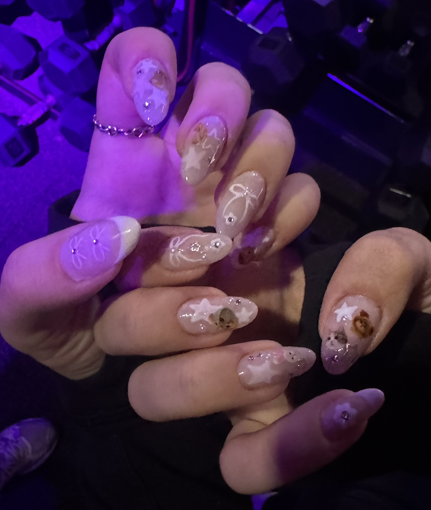
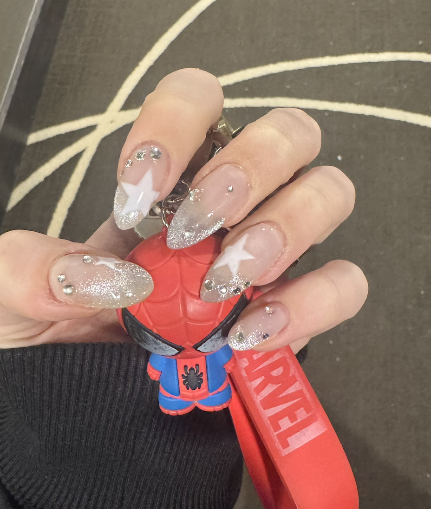
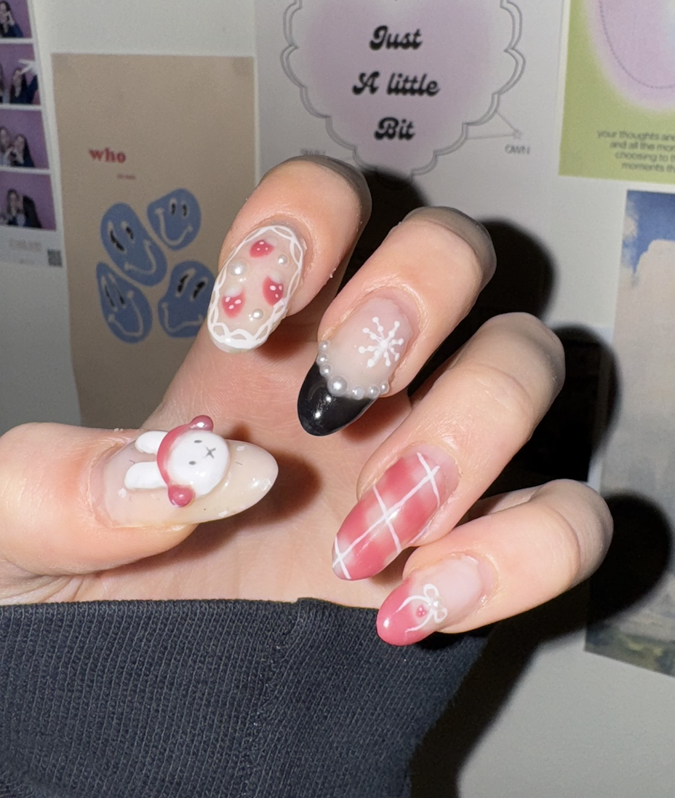

```{r setup, include=FALSE, echo=FALSE}
knitr::opts_chunk$set(echo = FALSE,
                      warning = FALSE, # suppressing warning messages
                      message = FALSE,
                      knitr.kable.max_rows = 6)

# attach any relevant packages
library(rmarkdown)
library(ggplot2)

# read the data files
courses <- read.csv(file = "courses.csv")
hobbies <- read.csv(file = "hobbies.csv")
```

# This R Markdown is to get to know Victoria!

## Bio {#bachelors-degree}
Hello! My name is Victoria and I am a fourth-year undergraduate student at the University of Toronto with a [Bioinformatics and Computational Biology](https://bcb.csb.utoronto.ca/) Specialist and a [Computer Science](https://web.cs.toronto.edu/) Major. I am particularly interested in machine learning and its applications in cancer research. In my free time, I enjoy pilates, reading, and listening to music.


## Bachelors Degree 
### {#bachelors-degree-table}
**Table 1. Record of all undergraduate courses** 
``` {r courses_table, include=TRUE,echo=TRUE}

# show a table with all my courses 
paged_table(courses)

```

### {#bachelors-degree-figure}

``` {r courses_figure, include=TRUE,echo=TRUE, fig.cap = "**Figure 1 Undargraduate Courses** A summary of the courses taken during my undergraduate degree organized by department."}

# create a plot from the courses data frame
course_plot <- ggplot(courses, aes(x=Course_Department)) +
  geom_bar(fill="steelblue") +
  theme_minimal() +
  theme(axis.text.x = element_text(angle=45, hjust=1)) +
  labs(title="Number of Courses Taken by Department",
       x="Department",
       y="Number of Courses")

# display the plot
print(course_plot)

  
```

## Hobbies
### {#my-hobbies}
### {#favorite-hobby}
I have a variety of hobbies that I enjoy in my free time! I love playing and watching tennis, watching (not playing) hockey, and going to pilates class. My current favourite hobby is reading before bed since it is such a great way to unwind and relax after a long day.


Take a look at the following graph to see how many hours a week I spend on each of my hobbies!

### {#hobbies-hours-per-week}

```{r hobbies_table, include=TRUE,echo=TRUE, fig.cap = "**Figure 2. My Hobbies** A list of my hobbies ordered by how many hours I spend on each per week."}
# plot how much time I spend on each hobby per week (ordered by hours_per_week)
hobby_plot <- ggplot(hobbies, aes(x=reorder(hobby, -hours_per_week), y=hours_per_week)) +
  geom_bar(stat="identity", fill="pink") +
  theme_minimal() +
  labs(title="Hours Spent on Hobbies per Week",
       x="Hobby",
       y="Hours per Week")

# display the plot
print(hobby_plot)

```


## Nails! {#custom-section}
One of the hobbies I enjoy the most is doing my own nails! I love creating different designs and watching a cozy show or movie while I do them.

Here are some of my most recent favourites!

{width="30%"}
{width="30%"}
{width="30%"}

## Questions to answer 

1.[ What is your bachelors degree?](#bachelors-degree)

2.[Which courses have you taken and in which departments?](#bachelors-degree-figure)

3.[What are your hobbies?](#my-hobbies)

4.[How many hours a week do you spend on each hobby?](#hobbies-hours-per-week)

5.[What is your favorite hobby?](#favorite-hobby)

6.[Add a custom section of your choosing!](#custom-section)

## Citations
Allaire J, Xie Y, Dervieux C, McPherson J, Luraschi J, Ushey K, Atkins
  A, Wickham H, Cheng J, Chang W, Iannone R (2025). _rmarkdown: Dynamic
  Documents for R_. R package version 2.30,
  <https://github.com/rstudio/rmarkdown>.
  
H. Wickham. ggplot2: Elegant Graphics for Data Analysis. Springer-Verlag
  New York, 2016.
